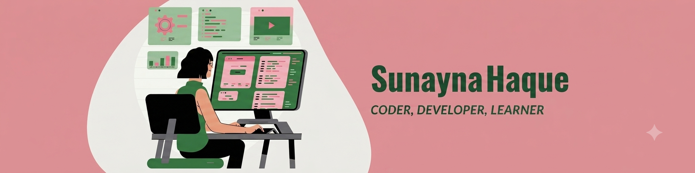

<!-- ═══════════════════════════════════════════════════════════════════════ -->
<!--                         SUNAYNA HAQUE                                    -->
<!--   Palette: Baby Pink #FFB6C1 · Rose #F48FB1 · Soft #FFC0CB               -->
<!--            Hot Pink #E0218A (accent) · Black #171717 · White #FFFFFF     -->
<!-- ═══════════════════════════════════════════════════════════════════════ -->

<!-- ── HERO BANNER (your uploaded image goes in ./banner.jpg.png) ── -->

<!-- animated twinkling divider -->

 

 

  

[`ABOUT`](#-about) &nbsp;•&nbsp; [`TOOLKIT`](#-toolkit--glam-loadout) &nbsp;•&nbsp; [`PROJECTS`](#-my-collection--take-a-look) &nbsp;•&nbsp; [`CONTRIBUTIONS`](#-github-contributions) &nbsp;•&nbsp; [`SAY HI`](#-slide-into-my-dms)

---

## `> ABOUT`

I'm **Sunayna** — a Computer Science student at **BRAC University** who builds full-stack web apps, explores **machine learning & data science**, and contributes to open source by helping bring the **Kubernetes docs to Bengali** 🇧🇩.

---

## `> TOOLKIT // GLAM LOADOUT`

**Languages**

**Frameworks & Libraries**

**Data / ML & Tools**

---

## `> MY COLLECTION // take a look`

*Fresh builds are on the way — check back soon!* 💗

 

### `> COMING SOON` 🚧

🩷 **Period Tracker** — a cycle-tracking web app · *in the works*
💰 **FinAssist** — personal finance helper · *in the works*
✨ *more sparkle on the way...*

---

## `> GITHUB CONTRIBUTIONS`

 

  

---

## `> SLIDE INTO MY DMs`

  

<!-- animated footer message -->

<!-- animated footer banner -->

