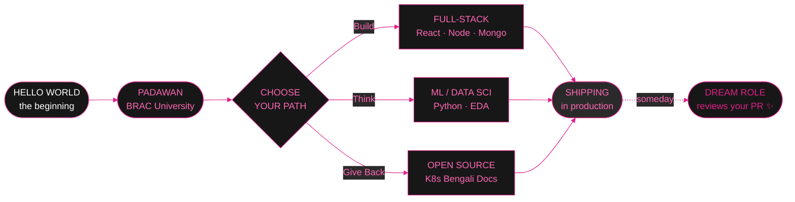
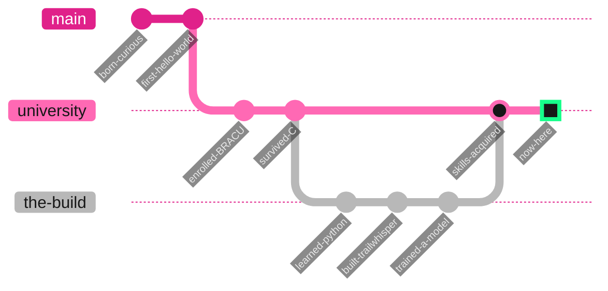

<!-- ═══════════════════════════════════════════════════════════════════════ -->
<!--                    SUNAYNA HAQUE · DREAMHOUSE OS                         -->
<!--   Palette: Barbie Pink #E0218A · Hot Pink #FF69B4 · Black #171717        -->
<!--            Ash #B8B8B8 · White #FFFFFF                                   -->
<!-- ═══════════════════════════════════════════════════════════════════════ -->

<!-- ── HERO BANNER (your uploaded image goes in ./assets/banner.png) ── -->
<div align="center">


<br/>


<br/>

<a href="https://github.com/sunayna-h?tab=followers">
  
</a>
<a href="https://github.com/sunayna-h?tab=repositories&sort=stargazers">
  
</a>


<br/><br/>

### `> WELCOME TO THE DREAMHOUSE // PICK A ROOM`

[`WHO AM I`](#-signal-received) &nbsp;•&nbsp; [`VIBE CHECK`](#-vibe-calibration) &nbsp;•&nbsp; [`TOOLKIT`](#-toolkit--glam-loadout) &nbsp;•&nbsp; [`BLUEPRINT`](#-dreamhouse-blueprint) &nbsp;•&nbsp; [`PROJECTS`](#-my-collection--take-a-look) &nbsp;•&nbsp; [`STATS`](#-sparkle-stats) &nbsp;•&nbsp; [`SAY-HI`](#-slide-into-my-dms)

</div>

---

```console
Microsoft Windows [Dreamhouse OS · Build 2026.pink]
(c) Malibu Systems Corp. All rights reserved. Be anything. Build everything. 💖

C:\Users\sunayna> boot --dreamhouse --sparkle
[ OK ]  mounting /dev/glitter ............................ shimmering
[ OK ]  loading project archive ........................... 4 pinned
[ OK ]  calibrating navigator .................. Dhaka -> everywhere
[ OK ]  brewing coffee ........................................ ready
[WARN]  cuteness levels exceeding safe thresholds
[FAIL]  bugs.dll ................ still here (see: git commit -m "later")

C:\Users\sunayna> whoami /full
```

```python
from malibu import Dreamhouse, BeAnything

class FullStackDeveloper(Dreamhouse):
    """Role: CSE Undergrad  |  Order: BRAC University"""
    CODENAME  = "sunayna-h"
    HOMEWORLD = "Dhaka, Bangladesh"
    SIGNATURE = "hot-pink"            # crystal: kyber... no wait, glitter
    rooms = {
        "building":   ["Full-Stack Web (MERN)", "APIs & Databases"],
        "thinking":   ["Machine Learning", "Data Science", "EDA"],
        "open_source":["Kubernetes Bengali Docs 🇧🇩"],
        "toolkit":    ["Python", "JavaScript", "React", "Node.js", "MongoDB"],
    }

    def sparkle_index(self) -> int:
        return sum(len(v) for v in self.rooms.values()) * 1_000

    def greet(self) -> str:
        return "Be anything. Build everything. 💖"

if __name__ == "__main__":
    me = FullStackDeveloper()
    print(f"> {me.CODENAME} @ {me.HOMEWORLD}")
    print(f"> sparkle-index: {me.sparkle_index()}")
    print(f"> {me.greet()}")
```

```console
> sunayna-h @ Dhaka, Bangladesh
> sparkle-index: 9000
> Be anything. Build everything. 💖
C:\Users\sunayna> _
```

---

## `> SIGNAL RECEIVED`

<div align="center">

</div>

> *"Code is like humor. When you have to explain it, it's bad."* — **Cory House**
>
> *"You can be a coder AND wear pink. I do both before breakfast."* — me, probably

I'm **Sunayna** — a Computer Science student at **BRAC University** who builds full-stack web apps, digs into data with **ML & data science**, and contributes to open source by helping bring the **Kubernetes docs to Bengali** 🇧🇩.

---

## `> VIBE CALIBRATION`

<div align="center">

| Reading | Level |
|:--|:--|
| **Light Side** — writes clean, commented code |  |
| **Chaos Side** — pushes to main at 2 AM |  |
| **Coffee Saturation** |  |
| **Tabs Open Right Now** |  |

*"It's not a bug, it's a feature in a fabulous outfit." ✨*

</div>

---

## `> TOOLKIT // GLAM LOADOUT`

<div align="center">

**Languages**

<a href="https://skillicons.dev">
  
</a>

**Frameworks & Libraries**

<a href="https://skillicons.dev">
  
</a>

**Data / ML & Tools**

<a href="https://skillicons.dev">
  
</a>

</div>

<br/>

<details>
<summary><b><code>&gt; OPEN THE CLOSET // detailed proficiency</code></b></summary>
<br>

```console
C:\Users\sunayna> toolkit --diagnostics
SKILL             PROFICIENCY                       STATUS
─────────────────────────────────────────────────────────────
Python            ████████████████████░░░░   82%    CONFIDENT
JavaScript        ██████████████████░░░░░░   74%    STRONG
React / MERN      █████████████████░░░░░░░   72%    STRONG
Node · Express    ███████████████░░░░░░░░░   64%    GROWING
MongoDB           ██████████████░░░░░░░░░░   58%    GROWING
Machine Learning  ████████████████░░░░░░░░   66%    LEARNING
─────────────────────────────────────────────────────────────
> currently leveling up. more sparkle incoming. ✨
```

</details>

<details>
<summary><b><code>&gt; WISHLIST // currently learning</code></b></summary>
<br>

- 🧠 **Machine Learning & Data Science** — teaching data to spill its secrets
- 🕸️ **MERN in the wild** — auth, sockets, and the eternal CORS drama
- 🌐 **Open Source** — translating Kubernetes docs to Bengali 🇧🇩
- ☁️ **Deployment** — because "it works on my machine" isn't a launch plan

</details>

---

## `> DREAMHOUSE BLUEPRINT`



<details>
<summary><b><code>&gt; TIMELINE // the path so far</code></b></summary>
<br>



</details>

---

## `> MY COLLECTION // take a look`

<p align="center">
  <a href="https://github.com/sunayna-h/TrailWhisper-">
    
  </a>
  <a href="https://github.com/sunayna-h/CSE422-Customer_Category_Classifier">
    
  </a>
</p>

<div align="center">

🌊 **[TrailWhisper](https://github.com/sunayna-h/TrailWhisper-)** — full-stack MERN travel journaling platform · [live demo →](https://trail-whisper-one.vercel.app)
📊 **[Customer Category Classifier](https://github.com/sunayna-h/CSE422-Customer_Category_Classifier)** — ML & EDA · customer segmentation
🤖 **[Autonomous ArUco Service Bot](https://github.com/sunayna-h)** — collab · multi-terrain autonomous robot
🌐 **[Kubernetes Bengali Docs](https://github.com/sunayna-h)** — open source · translating K8s docs to Bengali

<br/>

**`> COLLECTION STATUS // live telemetry`**

| Project | Last Signal | Size | Activity |
|:--|:--|:--|:--|
| `TrailWhisper` |  |  |  |
| `Customer Category Classifier` |  |  |  |

</div>

---

## `> SPARKLE STATS`

<div align="center">


<br/>


<br/><br/>


</div>

---

## `> MEDALS OF THE DREAMHOUSE`

<p align="center">
  
</p>

---

## `> GLITTER TRAIL // CONTRIBUTION SNAKE`

<div align="center">
  <picture>
    <source media="(prefers-color-scheme: dark)" srcset="https://raw.githubusercontent.com/sunayna-h/sunayna-h/output/github-contribution-grid-snake-dark.svg"/>
    <source media="(prefers-color-scheme: light)" srcset="https://raw.githubusercontent.com/sunayna-h/sunayna-h/output/github-contribution-grid-snake.svg"/>
    
  </picture>
</div>

---

<div align="center">
<details>
<summary><b>💖 <code>RESTRICTED // DO NOT OPEN THIS PANEL</code> 💖</b></summary>
<br>
<div align="left">

```console
C:\Users\sunayna> ACCESS DENIED
...
...override accepted. you're persistent. i respect that. 💅

                         .-"""""-.
                       .'  * * *  '.
                      /  *  ___  *  \
                     |  *  |   |  *  |
                     |  *  | ♥ |  *  |
                      \  *  '''  *  /
                       '.  * * *  .'
                         '-.....-'
                    [ TIARA UNLOCKED ]

> You found the secret holocron. It holds one truth:
  "It works on my machine" is a valid deploy strategy
   in exactly zero dreamhouses. 💔
> Reward: +1000 sparkle points. Go star a repo. Any repo. ⭐
```

</div>
</details>
</div>

---

## `> SLIDE INTO MY DMs`

<div align="center">

<a href="YOUR_LINKEDIN_URL">
  
</a>
<a href="mailto:sunaynahaque2002@gmail.com">
  
</a>
<a href="YOUR_INSTAGRAM_URL">
  
</a>
<a href="https://github.com/sunayna-h">
  
</a>

<br/><br/>


</div>

<!-- Footer banner -->

